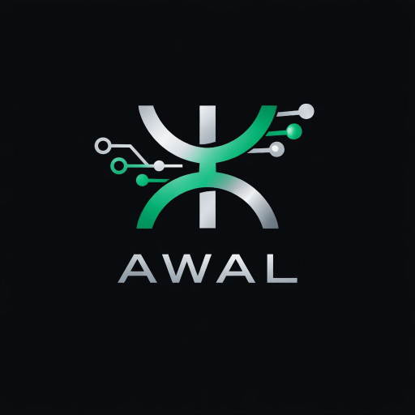

# ⵣ Awal-LM (Version 1.0)

<p align="center">
  
</p>

**Awal-LM** is the first specialized Large Language Model (LLM) designed specifically for the **Tamazight language** using the **Tifinagh script**. 

The name **"Awal"** means *"Word"* or *"Speech"* in Tamazight, reflecting our goal to give the Amazigh language a powerful digital voice in the era of Artificial Intelligence.

---

## 🌟 Overview
- **Architecture:** Based on the GPT-2 architecture.
- **Training Data:** Fine-tuned on 19,000+ high-quality sentences from the IRCAM corpus and Amazigh literature.
- **Format:** Optimized for efficient inference (approx. 318MB).
- **Deployment:** Live at [awal.rachidnichan.com](https://awal.rachidnichan.com)

## 🚀 Key Features
- **Authentic Generation:** Specialized in Tifinagh script text generation.
- **Cultural Awareness:** High understanding of Tamazight sentence structure and folk tales.
- **Lightweight:** Designed to run smoothly on standard hardware.

## 🛠️ Usage

To use **Awal-LM**, you will need the `transformers` library installed:

```python
from transformers import pipeline

# Load the model
pipe = pipeline("text-generation", model="rachidnichan/Awal-LM")

# Generate text
prompt = "ⴰⵣⵓⵍ"
result = pipe(prompt, max_new_tokens=50, temperature=0.7, repetition_penalty=1.2)

print(result[0]['generated_text'])
```

## 🌍 Vision
Awal-LM is an open-source project dedicated to preserving Amazigh heritage. We believe that language is the heart of identity, and AI is the bridge to its digital future.

## 🤝 Contributing
We welcome contributions to improve the future of Awal-LM:
*   **Dataset Expansion:** Help us gather more high-quality Tamazight texts.
*   **Tokenization:** Enhancing the Tifinagh tokenizer for better efficiency.
*   **Applications:** Developing community-driven tools and apps using the model.

## 📄 License
This project is licensed under the **MIT License**.
---
Developed with ❤️ by **Rachid Nichan**
